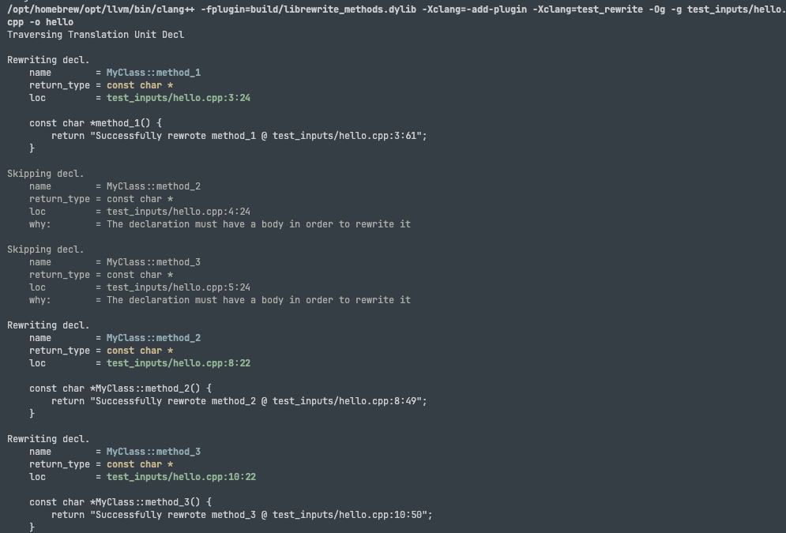
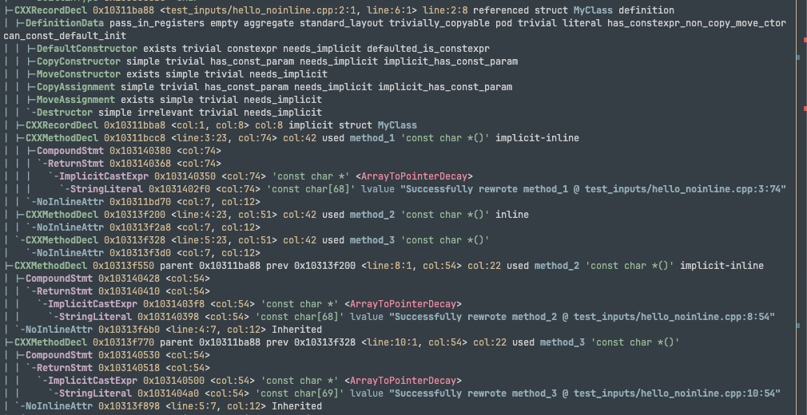

# Very Simple Compiler Plugin

This repo demonstrates how to rewrite method bodies using Clang Plugins.

## The Problem (Why I've posted this repo)

The plugin I've created here rewrites all method bodies it discovers in
`test_inputs/hello.cpp`.

`method_1`, `method_2`, and `method_3` are all reported as being rewritten by
the plugin, however, changes are only propagated to method bodies that are
marked as being `inline` (either implicitly, or explicitly).

If you run the executable compiled with the plugin, `method_3` is the only
method that still returns the old output, DESPITE the compiler _stating_ that
method_3 is rewritten during compilation (and printing out the expected body):



If you look at the output, `method_3` is rewritten, but running the executable
still produces the old output (the output before rewriting):

```
Successfully rewrote method_1 @ test_inputs/hello.cpp:3:56
Successfully rewrote method_2 @ test_inputs/hello.cpp:8:54
method_3
```

## Building and Running the Plugin

Describes how to build and run the plugin.

There are two ways - you can use `just`, or you can execute the steps on the
command line.

### Building and running (just)

You can build and run using the justfile, assuming that clang is at a somewhat
standard location. If not, CMake will error during configuration.

```sh
just build_test_file test_inputs/hello.cpp -o hello
```

### Building and running (manual)

**Macos:**

```sh
cmake -B build -G Ninja -DCMAKE_PREFIX_PATH=/opt/homebrew/opt/llvm
cmake --build build
/opt/homebrew/opt/llvm/bin/clang++ \
    -fplugin=build/librewrite_methods.dylib \
    -Xclang=-add-plugin \
    -Xclang=test_rewrite \
    -Og -g test_inputs/hello.cpp -o hello
```

**Linux:**

Assuming clang can be found via `find_package`, you can build on linux like so:

```sh
cmake -B build -G Ninja
cmake --build build
clang++ \
    -fplugin=build/librewrite_methods.so \
    -Xclang=-add-plugin \
    -Xclang=test_rewrite \
    -Og -g test_inputs/hello.cpp -o hello
```

### Running the compiled program

All methods listed above should produce an executable named `hello`. This
executable is a compiled version of `test_inputs/hello.cpp`.

```sh
./hello
```

## Diagnosing the issue

**Summary:** If you ask clang to dump the AST after rewrite, the changes from
the rewrite have correctly propagated.

However, if you inspect the generated IR, `method_1` and `method_2` have
correctly re-written bodies, but `method_3` does not.

### Dumping the AST after rewrite (output)

If I dump the AST after rewriting, things look good!

```sh
just build_test_file test_inputs/hello_noinline.cpp -Xclang=-ast-dump -S
```

Note that here, I'm using a version of `hello.cpp` where all methods are marked
with `[[gnu::noinline]]`. This is to prevent clang from inlining the methods, so
we can see their body in assembly and in the generated IR.



The rewritten `method_3` has an address of `0x10313f770` in the AST, and indeed,
this is the same method being called in `main`:

```cpp
|-CXXMethodDecl 0x10313f770 parent 0x10311ba88 prev 0x10313f328 <line:10:1, col:54> col:22 used method_3 'const char *()'
| |-CompoundStmt 0x103140530 <col:54>
| | `-ReturnStmt 0x103140518 <col:54>
| |   `-ImplicitCastExpr 0x103140500 <col:54> 'const char *' <ArrayToPointerDecay>
| |     `-StringLiteral 0x1031404a0 <col:54> 'const char[69]' lvalue "Successfully rewrote method_3 @ test_inputs/hello_noinline.cpp:10:54"
```

Call in main:

```cpp
    `-CallExpr 0x103140238 <line:20:5, col:22> 'int'
      |-ImplicitCastExpr 0x103140220 <col:5> 'int (*)(const char *)' <FunctionToPointerDecay>
      | `-DeclRefExpr 0x103140200 <col:5> 'int (const char *)' lvalue Function 0x10313fa78 'puts' 'int (const char *)'
      `-CXXMemberCallExpr 0x1031401d0 <col:10, col:21> 'const char *'
        `-MemberExpr 0x1031401a0 <col:10, col:12> '<bound member function type>' .method_3 0x10313f770
          `-DeclRefExpr 0x103140180 <col:10> 'MyClass' lvalue Var 0x10313fce0 'm' 'MyClass'
```

So the AST at this stage refers to the correct method as far as I can tell.

### Dumping the IR after rewrite (output)

The problem manifests by the time we get to the generated IR. This IR indicates
that `method_3` is returning the old string, `"method_3"`:

```
@.str = private unnamed_addr constant [9 x i8] c"method_3\00", align 1, !dbg !0
@.str.1 = private unnamed_addr constant [68 x i8] c"Successfully rewrote method_1 @ test_inputs/hello_noinline.cpp:3:74\00", align 1, !dbg !8
@.str.2 = private unnamed_addr constant [68 x i8] c"Successfully rewrote method_2 @ test_inputs/hello_noinline.cpp:8:54\00", align 1, !dbg !13

; Function Attrs: mustprogress nofree noinline norecurse nosync nounwind ssp willreturn memory(none) uwtable(sync)
define noundef nonnull ptr @_ZN7MyClass8method_3Ev(ptr nocapture noundef nonnull readnone align 1 dereferenceable(1) %0) local_unnamed_addr #0 !dbg !25 {
    #dbg_value(ptr %0, !36, !DIExpression(), !38)
  ret ptr @.str, !dbg !39
}
```

The new string (corresponding to the new body) does not show up at this stage!
